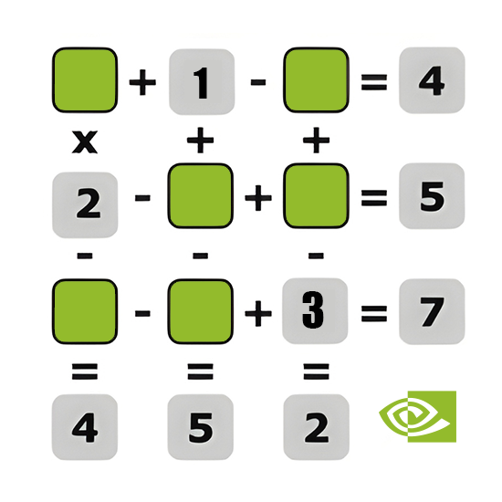

# C++/CUDA Accelerator for the NumericBoard Problem

This solution leverages the GPU's massive parallelism by having
the CPU distribute a wide range of subproblems to the CUDA cores.
Specifically, it utilizes an RTX 3090 FE with 10496 CUDA cores.
The implementation also features enhanced pruning techniques on both
the CPU and GPU, significantly reducing the computation time.
In some cases, this leads to a speedup of up to 1000x due to GPU
parallelization and other optimizations.

º The NumericBoard problem, while inherently sequential, is tackled
through a parallelization strategy. The CPU explores the first N levels
of the search tree, generating a list of partially solved states,
which become individual subproblems. These subproblems are then
dispatched to the GPU. Each GPU thread, assigned a subproblem,
executes an iterative backtracking algorithm. Upon finding a solution,
the global atomic counter is incremented to ensure thread-safe accumulation.

Reducing the time in sixth test with 14 unknowns numbers from **647,39s** to **0,58s** and
finding the same 83 possible answers
